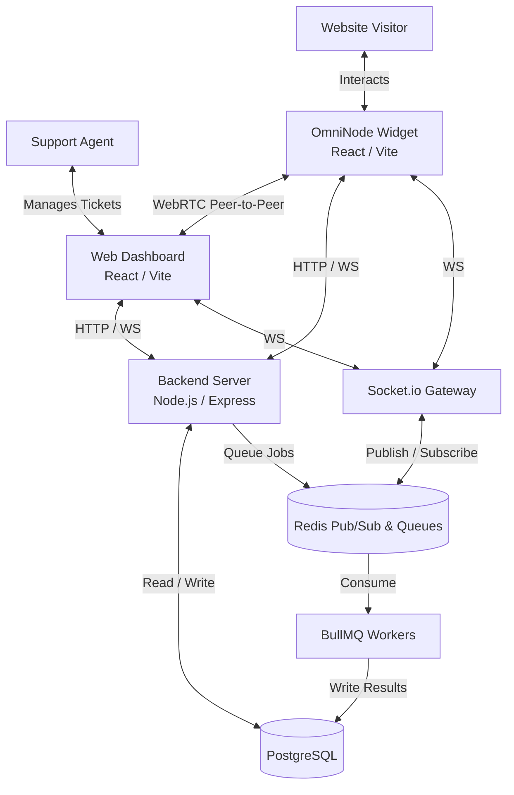

# 🌌 OmniNode Platform

OmniNode is a powerful, multi-tenant customer support platform that provides zero-config real-time live chat, WebRTC video calling, and intelligent ticket routing. Built for scale, it enables organizations to seamlessly integrate top-tier agent support into any application with a single script tag.

## ⚡ Core Features

- **Real-Time Live Chat**: Socket.io powered messaging with Redis Pub/Sub for horizontal scaling. Messages persist instantly to PostgreSQL.
- **WebRTC Video Calls**: Peer-to-peer video with STUN/TURN server support. Agents can seamlessly start video calls with visitors directly from the dashboard.
- **Smart Ticket Routing**: BullMQ job queues auto-assign incoming conversations to available agents using least-load optimization algorithms.
- **Multi-Tenant Architecture**: Complete tenant isolation at every layer (database, sockets, and API routes). Each organization gets its own secure namespace.
- **Zero-Config Widget**: No complex SDKs. Drop a simple script tag into any HTML website to start engaging with visitors instantly.

---

## 🏗️ System Architecture



---

## 🛠️ Technology Stack

### Backend (`apps/backend`)
- **Runtime & Framework**: Node.js, Express.js
- **Language**: TypeScript
- **Database ORM**: Prisma (connected to PostgreSQL)
- **Real-Time Engine**: Socket.IO with Redis Adapter
- **Task Queues**: BullMQ & Redis
- **Authentication**: JWT, bcrypt

### Web Dashboard (`apps/web`)
- **Framework**: React 19, Vite
- **Language**: TypeScript
- **Styling**: Tailwind CSS v4, DaisyUI
- **Real-Time Client**: socket.io-client

### Embeddable Widget (`apps/widget`)
- **Framework**: React 19, Vite
- **Language**: TypeScript
- **Styling**: Tailwind CSS v4
- **Packaging**: Built as a zero-config embeddable JS snippet

---

## 🚀 Getting Started

### Prerequisites

Ensure you have the following installed:
- [Node.js](https://nodejs.org/) (v18 or higher recommended)
- [npm](https://www.npmjs.com/)

### Installation & Setup

1. **Clone the repository**
   ```bash
   git clone https://github.com/Atul1231/OmniNode-Patform.git
   cd OmniNode-platform
   ```

2. **Start Infrastructure Services (Postgres & Redis)**
   Make sure Docker is running on your machine.
   ```bash
   npm run docker:up
   ```

3. **Install Dependencies & Generate Prisma Client**
   This command installs dependencies across all workspaces and generates the Prisma schema.
   ```bash
   npm run setup
   ```

4. **Run Database Migrations**
   ```bash
   npm run prisma:migrate -w apps/backend
   ```

### Running the Platform

You can run individual services using npm workspaces:

- **Start the Backend Server**
  ```bash
  npm run backend:dev
  ```

- **Start the Web Dashboard**
  ```bash
  npm run dashboard:dev
  ```

- **Start the Widget Development Server**
  ```bash
  npm run widget:dev
  ```

*(To stop the Docker containers when you're done, run `npm run docker:down`)*

---

## 🔌 Widget Integration

Integrating the OmniNode widget into any website is frictionless. Just copy and paste the snippet below right before your closing `</body>` tag.

```html
<!-- OmniNode Live Chat Widget -->
<script
  src="https://your-domain.com/widget.js"
  data-api-key="YOUR_WORKSPACE_API_KEY"
  data-theme="dark"
  data-position="bottom-right"
  defer
></script>
```

For advanced setup instructions (like React/Next.js integration), please see our [Integration Docs](./apps/widget/INTEGRATION_DOCS.md).

---

## 📄 License

This project is licensed under the ISC License.
